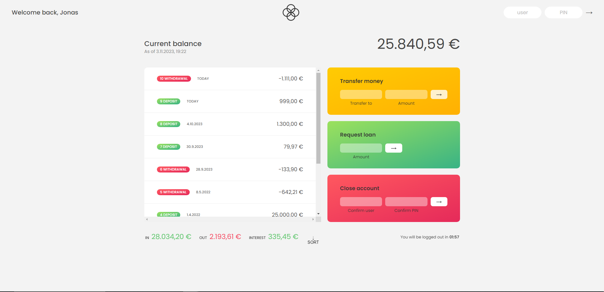

# Bankist-App JavaScript-Code Überblick

## Zusammenfassung

Dieser JavaScript-Code stellt eine einfache Bankanwendung dar. Die App ermöglicht es Benutzern, sich einzuloggen, ihre Kontostände anzuzeigen, Überweisungen zu tätigen, Kredite zu beantragen, Konten zu schließen und Transaktionshistorien zu sortieren. Sie zeichnet alle Transaktionen auf und bietet eine automatische Abmeldung nach Inaktivität.

## Kernfunktionen

- **Einloggen**: Benutzer können sich mit einem Benutzernamen und PIN-Code anmelden.

- **Kontostände anzeigen**: Benutzer können ihre aktuellen Kontostände einsehen.

- **Überweisungen**: Geld kann zwischen verschiedenen Konten überwiesen werden.

- **Kreditanfragen**: Benutzer können Kredite beantragen, wenn sie bestimmte Voraussetzungen erfüllen.

- **Konten schließen**: Konten können geschlossen werden, wenn die erforderlichen Informationen eingegeben werden.

- **Transaktionen sortieren**: Die App ermöglicht das Sortieren von Transaktionshistorien.

- **Transaktionsaufzeichnungen**: Alle Transaktionen werden mit Zeitstempeln festgehalten.

- **Automatische Abmeldung**: Benutzer werden nach Inaktivität automatisch ausgeloggt.

## Vorschau

 

## Verwendung

Dieser Code kann als Grundlage für die Entwicklung einer Banking-Anwendung dienen. Er bietet grundlegende Bankfunktionen und eine übersichtliche Benutzeroberfläche.

